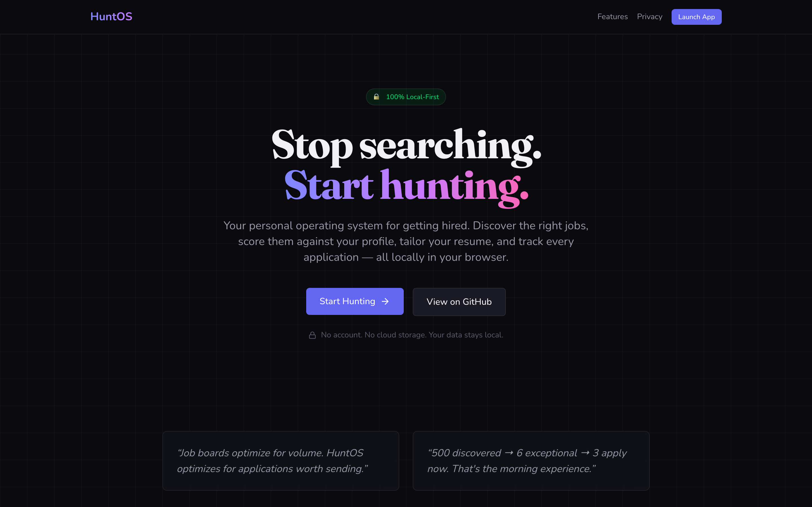
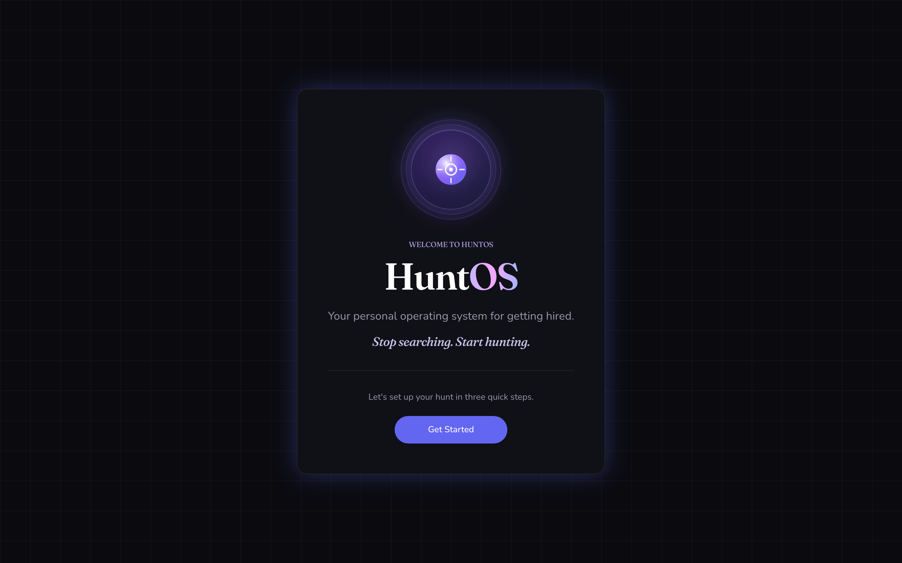
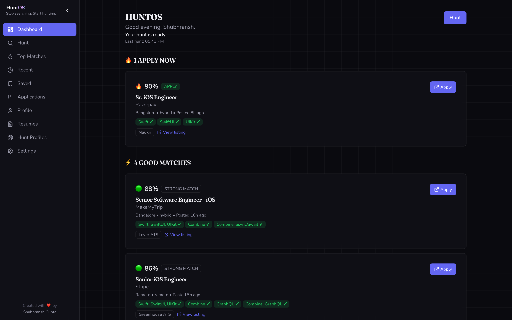
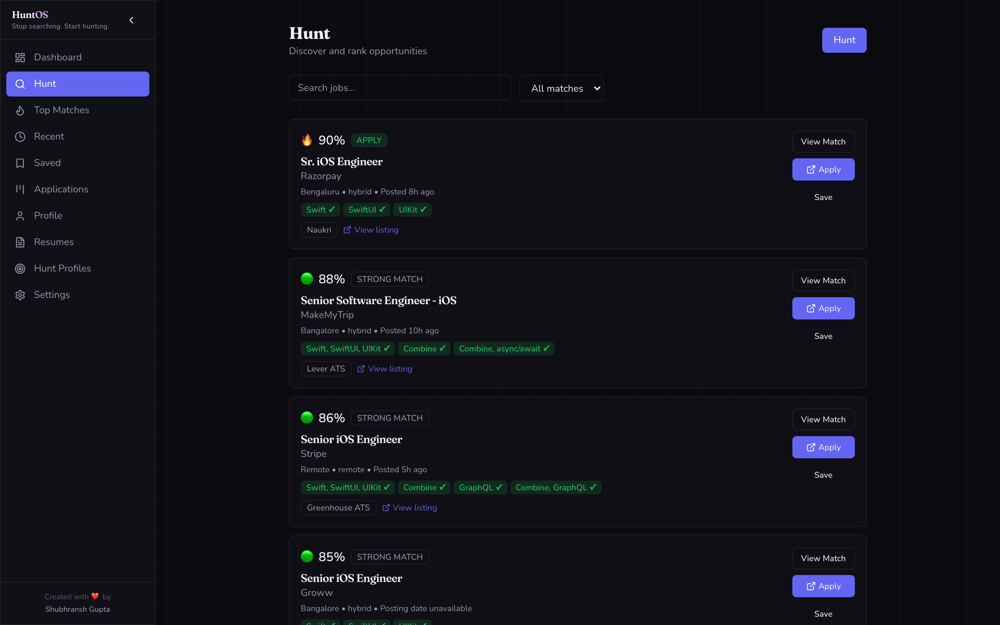
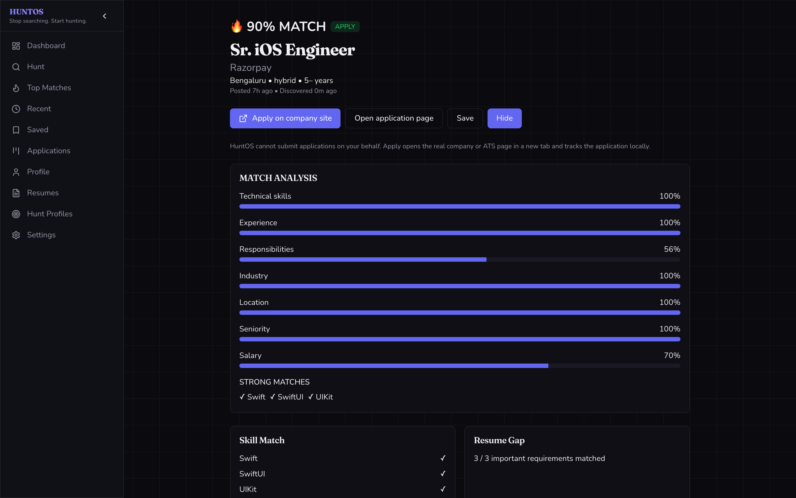
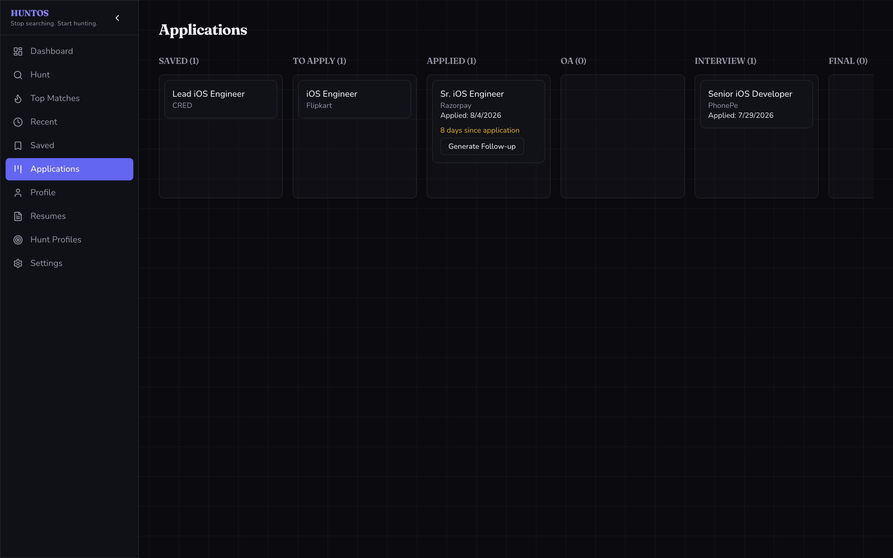

<p align="center">
  
</p>

<h1 align="center">HuntOS</h1>

<p align="center">
  <strong>Stop searching. Start hunting.</strong><br />
  Your personal operating system for getting hired — 100% local-first in your browser.
</p>

<p align="center">
  <a href="https://shubhransh-gupta.github.io/HuntOS/"><strong>Live Demo</strong></a>
  ·
  <a href="https://github.com/shubhransh-gupta/HuntOS">GitHub</a>
  ·
  <a href="#quick-start">Quick Start</a>
  ·
  <a href="https://github.com/shubhransh-gupta/HuntOS/discussions">Discussions</a>
</p>

<p align="center">
  <a href="https://github.com/shubhransh-gupta/HuntOS/stargazers">
    
  </a>
  
  
  
</p>

<p align="center">
  <a href="https://github.com/shubhransh-gupta/HuntOS">
    
  </a>
</p>

<p align="center">
  
</p>

---

HuntOS collapses the entire job search loop — discover, evaluate, tailor, apply, track — into a single focused workspace. **All profile, resume, and application data stays in your browser by default** — no account, no cloud storage.

🔒 **Runs entirely in your browser.**

## Why developers star HuntOS

| Spreadsheet / Notion chaos | HuntOS |
|---|---|
| Jobs scattered across tabs and sheets | One workspace: discover → score → tailor → track |
| "Did I already apply here?" | Canonical dedup across Greenhouse, Lever, imports |
| Resume copy-paste for every role | Tailored resume per job from one master profile |
| No idea why a role is a fit | Explainable match scores (skills, seniority, salary) |
| Data uploaded to another SaaS | **100% local-first** — IndexedDB in your browser |

> Job hunting is already painful. If HuntOS saves you time, **[star the repo](https://github.com/shubhransh-gupta/HuntOS/stargazers)** — it helps others discover a private alternative to yet another cloud tracker.

## Screenshots

### Welcome & onboarding
<p align="center">
  
</p>

<p align="center"><em>First launch walks you through resume upload, master profile, and your first hunt profile.</em></p>

### Dashboard
<p align="center">
  
</p>

<p align="center"><em>Jobs grouped by what to do about them — apply now first, good matches below — instead of a raw feed.</em></p>

### Hunt & job discovery
<p align="center">
  
</p>

<p align="center"><em>Every result is deduplicated across sources, scored against your profile, and labelled with where it came from.</em></p>

### Match analysis
<p align="center">
  
</p>

<p align="center"><em>Every score is explainable — skills, experience, responsibilities, industry, location, seniority, and salary.</em></p>

### Application tracker
<p align="center">
  
</p>

<p align="center"><em>Track every application from saved to offer, with follow-up nudges when a stage goes quiet.</em></p>

## Features

- ✓ Multi-source job discovery (sample data, Greenhouse, Lever, public URLs, manual import)
- ✓ Canonical deduplication across sources
- ✓ Transparent matching engine with explainable scores
- ✓ Hunt profiles with role, location, salary, and keyword filters
- ✓ Resume upload & AI parsing (PDF, DOCX, TXT, MD)
- ✓ Master resume as source of truth — AI never fabricates experience
- ✓ Tailored resume generation per job with ATS estimate
- ✓ Application Kanban tracker (Saved → Applied → Interview → Offer)
- ✓ Follow-up intelligence and browser notifications
- ✓ Command palette (⌘K) and keyboard shortcuts
- ✓ Export everything (JSON, CSV, PDF, DOCX)
- ✓ Pluggable AI providers: OpenAI, Anthropic, Ollama, OpenAI-compatible

## Privacy

**Your resume, jobs, and application history never leave your browser by default.**

- No account required
- IndexedDB storage — profile, jobs, and apps stored locally
- AI analysis only sends selected text to your configured provider
- Export or delete all data anytime from Settings
- Sources that block browser access fail gracefully — no CAPTCHA bypass

See [PRIVACY.md](./PRIVACY.md) for details.

## Quick Start

```bash
git clone https://github.com/shubhransh-gupta/HuntOS.git
cd HuntOS
npm install
npm run dev
```

Open [http://localhost:5173](http://localhost:5173) for the marketing site, or [http://localhost:5173/app](http://localhost:5173/app) to launch the app.

## Usage

1. **Launch** the app and complete onboarding (resume → profile → hunt profile)
2. **Hunt** for jobs using sample data or live sources
3. **Review** top matches with explainable scoring
4. **Tailor** your resume for high-fit roles
5. **Track** applications on the Kanban board

### Configure AI (optional)

1. **Settings → AI Provider**
2. Choose provider and model
3. Enter API key (stored locally in IndexedDB only)
4. **Test Connection**

Without an API key, HuntOS uses a mock provider for offline development.

### Configure Live Sources

1. **Settings → Live Job Sources**
2. Add Greenhouse board slugs (e.g. `figma`) or Lever companies (e.g. `netflix`)
3. Enable sources in your **Hunt Profile**
4. Run a **Hunt**

## Scripts

| Command | Description |
|---------|-------------|
| `npm run dev` | Start dev server |
| `npm run build` | Production build |
| `npm run build:pages` | Build for GitHub Pages |
| `npm run test` | Run Vitest tests |
| `npm run test:e2e` | Drive onboarding in a real browser against a production build |
| `npm run typecheck` | TypeScript check |
| `npm run preview` | Preview production build |
| `npm run screenshots` | Regenerate the README screenshots from a seeded demo database |

Screenshots are captured with Playwright against a real production build, seeded with a
demo profile so the UI shows meaningful data. Run `npx playwright install chromium` once first.

## Tech Stack

- **React 19** + **Vite** + **TypeScript**
- **Tailwind CSS v4** — dark grid UI with glass panels
- **Dexie.js** — IndexedDB storage abstraction
- **Vitest** — matching, dedup, and source adapter tests
- **GitHub Pages** — automated deploy on `main` via Actions

## Project Structure

```text
src/
├── components/       # UI, layout, marketing, jobs
├── features/         # Hunt pipeline, settings
├── hooks/            # App state, keyboard shortcuts
├── pages/            # Marketing, dashboard, hunt, settings
├── services/
│   ├── ai/           # OpenAI, Anthropic, Ollama adapters
│   ├── matching/     # Scoring engine, dedup, freshness
│   ├── sources/      # Greenhouse, Lever, sample data, import
│   └── storage/      # Dexie / IndexedDB
└── types/
```

See [ARCHITECTURE.md](./ARCHITECTURE.md) for data flow, source adapters, and extension points.

## Contributing

`main` is protected — open a pull request instead of pushing directly.

**Good first issues:** check [Issues](https://github.com/shubhransh-gupta/HuntOS/issues) and [Discussions](https://github.com/shubhransh-gupta/HuntOS/discussions) for roadmap ideas.

```bash
git checkout -b feature/my-change
git commit -am "Describe your change"
git push -u origin feature/my-change
gh pr create
```

## Share HuntOS

If HuntOS helped your job search, consider:
- **[⭐ Starring the repo](https://github.com/shubhransh-gupta/HuntOS/stargazers)** on GitHub
- Sharing the [live demo](https://shubhransh-gupta.github.io/HuntOS/) with friends who are hunting
- Opening a [Discussion](https://github.com/shubhransh-gupta/HuntOS/discussions) with feedback or feature ideas

## License

MIT — see [LICENSE](./LICENSE).
